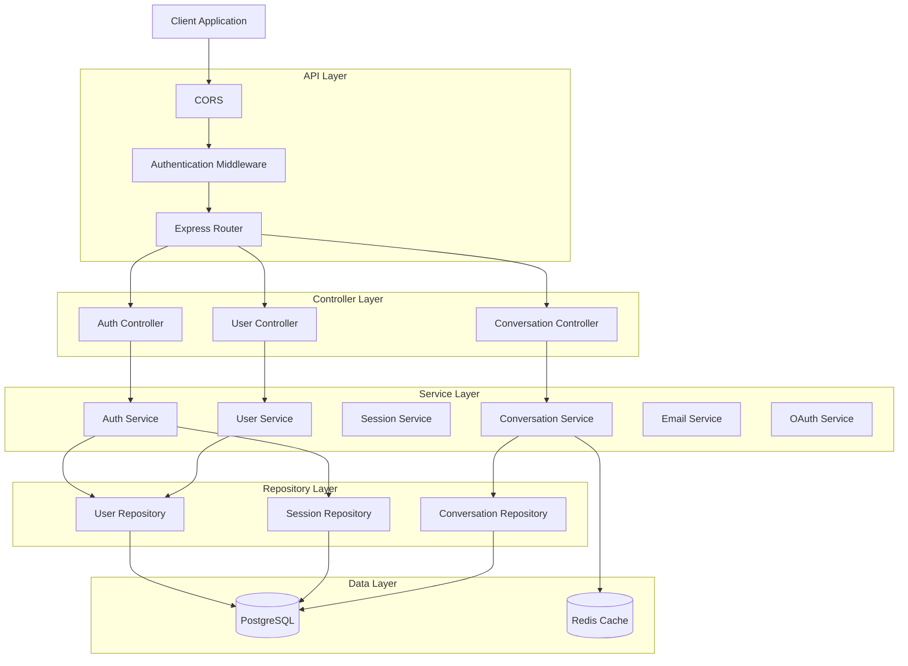

## 🏛️ Architecture

The API follows a **layered architecture** designed for scalability, maintainability, and clear separation of concerns.



### Design Patterns

| Pattern | Purpose |
|:---|:---|
| Repository Pattern | Abstract database operations |
| Service Layer Pattern | Separate business logic from controllers |
| Middleware Pattern | Handle authentication and request processing |
| Singleton Pattern | Manage database and Redis connections |
| Factory Pattern | Generate tokens and authentication providers |

## 📂 Project Structure

```text
auth-api/
│
├── src/
│
│   ├── controllers/
│   │   ├── auth.controller.ts
│   │   ├── user.controller.ts
│   │   └── conversation.controller.ts
│   │
│   ├── routes/
│   │   ├── auth.routes.ts
│   │   ├── user.routes.ts
│   │   └── conversation.routes.ts
│   │
│   ├── services/
│   │   ├── auth.service.ts
│   │   ├── user.service.ts
│   │   ├── session.service.ts
│   │   ├── conversation.service.ts
│   │   ├── email.service.ts
│   │   └── oauth.service.ts
│   │
│   ├── repositories/
│   │   ├── user.repository.ts
│   │   ├── session.repository.ts
│   │   └── conversation.repository.ts
│   │
│   ├── middleware/
│   │   ├── auth.middleware.ts
│   │   ├── validation.middleware.ts
│   │   └── error.middleware.ts
│   │
│   ├── models/
│   │   ├── user.model.ts
│   │   ├── session.model.ts
│   │   └── conversation.model.ts
│   │
│   ├── validations/
│   │   ├── auth.validation.ts
│   │   ├── user.validation.ts
│   │   └── conversation.validation.ts
│   │
│   ├── utils/
│   │   ├── token.utils.ts
│   │   ├── encryption.utils.ts
│   │   └── validation.utils.ts
│   │
│   ├── config/
│   │   ├── database.config.ts
│   │   ├── redis.config.ts
│   │   └── oauth.config.ts
│   │
│   ├── types/
│   │   ├── auth.types.ts
│   │   ├── user.types.ts
│   │   ├── conversation.types.ts
│   │   └── response.types.ts
│   │
│   ├── docs/
│   │   └── swagger.config.ts
│   │
│   ├── database/
│   │   └── prisma.ts
│   │
│   └── app.ts
│
│
├── tests/
│   ├── unit/
│   ├── integration/
│   └── e2e/
│
├── docker/
│   └── Dockerfile
│
├── .env.example
├── docker-compose.yml
├── package.json
├── tsconfig.json
└── README.md 
```

## 🚀 Setup & Running

This project uses **Docker Compose** to run the API, PostgreSQL database, and Redis services together.


### 📋 Prerequisites

Make sure you have installed:

| Requirement | Version |
|:---|:---|
| Docker | Latest |
| Docker Compose | Latest |
| Git | Latest |

## 📥 Installation

Clone the repository:

```bash
git clone <repository-url>
cd spur-ai-chat
```

Create environment file:

```bash
cp .env.example .env
```

Update required variables:

```env
DB_HOST=""
DB_PORT=""
DB_NAME=""
DB_USER=""
DB_PASSWORD=""

REDIS_HOST=""
REDIS_PORT=""

BREVO_API_KEY=""
BREVO_SENDER_EMAIL=""
BREVO_SENDER_NAME=""

APP_URL=""

# Google OAuth
GOOGLE_CLIENT_ID=""
GOOGLE_CLIENT_SECRET=""
GOOGLE_CALLBACK_URL=""

# GitHub OAuth
GITHUB_CLIENT_ID=""
GITHUB_CLIENT_SECRET=""
GITHUB_CALLBACK_URL=""

GEMINI_API_KEY=""

```

## 🐳 Start Application

Build and start all containers:

```bash
docker compose up --build
```

Run in background:

```bash
docker compose up -d
```

## 📦 Running Services

| Service | Description | Port |
|:---|:---|:---|
| API | Express + TypeScript Server | 5000 |
| PostgreSQL | Database | 5432 |
| Redis | Cache / Session Store | 6379 |

---

## 🔍 Check Containers

```bash
docker compose ps
```

---

## 🗄️ Database Migration

Navigate to the backend directory:

```bash
cd backend/src/
```

Run Sequelize migrations:

```bash
npx sequelize-cli db:migrate
```

Check migration status:

```bash
npx sequelize-cli db:migration:status
```

Undo the latest migration:

```bash
npx sequelize-cli db:migrate:undo
```

## 🔐 Admin Account Setup

After completing the database migration, create an admin account using the terminal command.

### Navigate to backend directory

```bash
cd backend/src/
```

### Create admin user

```bash
npm run create-admin
```

Enter the required details:

```text
Email:
Password:
```

The created user will have:

```text
Role: admin
Status: active
```

### Verify users

```bash
npm run list-users
```
## 🗃️ Entity Relationship Diagram (ERD)

Database ERD diagram:

🔗 [View ERD Diagram](https://lucid.app/lucidchart/1f8bf1da-a46d-480e-a2ca-6a144825862e/edit?beaconFlowId=7FC41CEE48615FB8&invitationId=inv_18e98bfa-fc61-4af5-ab7e-57f260ee6f10&page=0_0#)

The ERD includes:

- User management entities
- Authentication and session tables
- Conversation and message relationships
- OAuth provider connections
- Database relationships and constraints

<div align="center">

Made with ❤️ by Karthikeya

</div>
