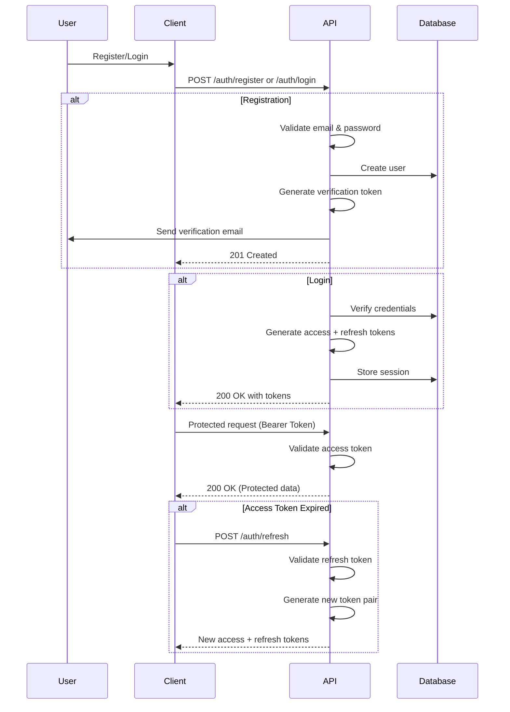
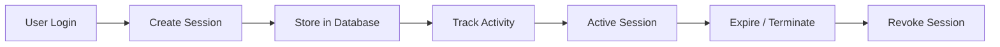
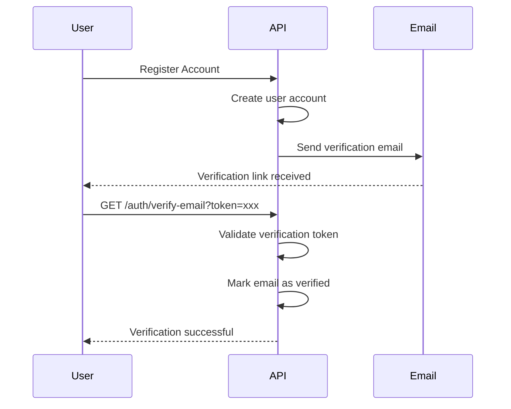
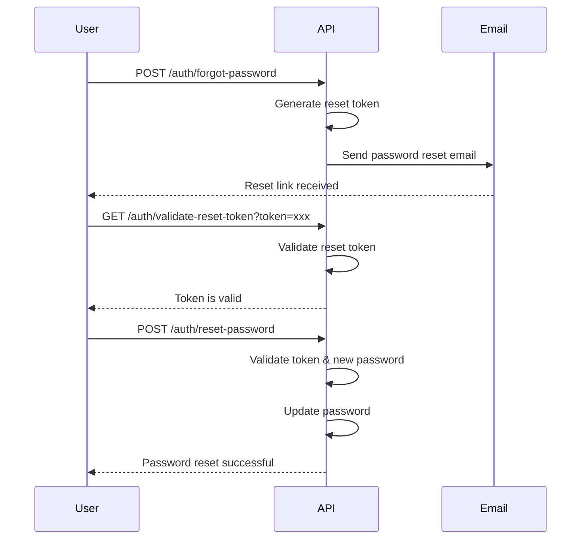
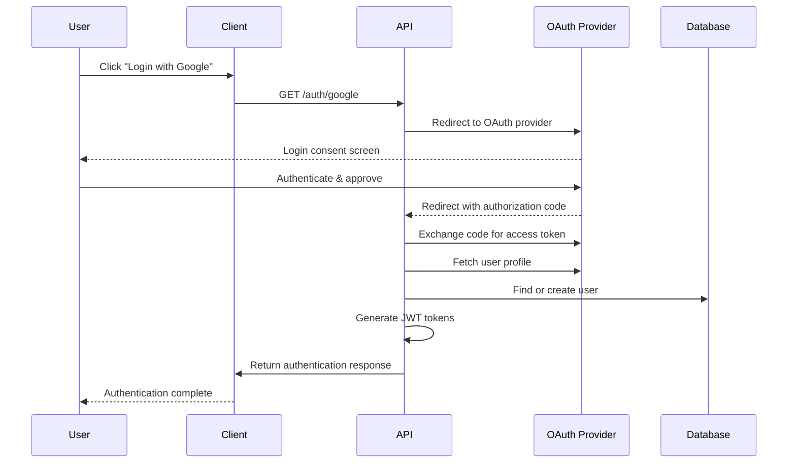

# 🔐 Authentication & Session Management API

<div align="center">

### Secure • Scalable • Production Ready

A production-ready **Authentication & Session Management API** built with **Node.js**, **Express.js**, **TypeScript**, **JWT**, **PostgreSQL**, and **Redis**. Designed with modern security practices, scalable architecture, and comprehensive API documentation.

<p align="center">
  
  
  
</p>

<p align="center">
  
  
  
</p>

<p align="center">
  
  
</p>

<p align="center">
  <strong>JWT Authentication</strong> •
  <strong>Role-Based Authorization</strong> •
  <strong>Session Management</strong> •
  <strong>Refresh Tokens</strong> •
  <strong>Redis Caching</strong> •
  <strong>REST API</strong>
</p>

---

</div>

## 📋 Table of Contents


<div align="center">

| Section | About |
|:---|:---|
| [Overview](#overview) | Introduction and project summary |
| [Features](#features) | Core authentication and session features |
| [Tech Stack](#tech-stack) | Technologies and frameworks used |
| [Architecture](#architecture) | System design and application flow |
| [Project Structure](#project-structure) | Folder organization and code structure |
| [Installation](#installation) | Setup and dependency installation steps |
| [Environment Variables](#environment-variables) | Required configuration settings |
| [Running the Project](#running-the-project) | Development and production execution |
| [API Documentation](#api-documentation) | Swagger and API usage guide |
| [Authentication Flow](#authentication-flow) | Login, token, and authorization flow |
| [Session Management](#session-management) | Session handling and token lifecycle |
| [Email Verification Flow](#email-verification-flow) | User email verification process |
| [Password Reset Flow](#password-reset-flow) | Secure password recovery process |
| [OAuth Flow](#oauth-flow) | Third-party authentication integration |
| [API Reference](#api-reference) | Available API endpoints |
| [Error Handling](#error-handling) | Error responses and handling strategy |
| [Security Features](#security-features) | Security practices and protections |
| [Scripts](#scripts) | Available npm commands |
| [Deployment](#deployment) | Production deployment guide |
| [Contributing](#contributing) | Contribution guidelines |
| [License](#license) | Project license information |

</div>

## 📌 Overview

The **Authentication & Session Management API** is a secure, scalable, and production-ready authentication system designed for modern web applications.

Built with **Express.js** and **TypeScript**, this API follows industry-standard security practices and provides a complete authentication workflow including **JWT authentication**, **refresh token rotation**, **session management**, **email verification**, **password recovery**, and **OAuth authentication** with providers like Google and GitHub.

### ✨ Key Highlights

<div align="center">

| Feature | Description |
|:---|:---|
| ✅ Production Ready | Secure, tested, and optimized for real-world applications |
| 🔷 Type Safe | Built with TypeScript for reliable and maintainable code |
| 🌐 RESTful API | Clean and scalable API architecture |
| 📚 Swagger Documentation | Interactive and comprehensive API documentation |
| 📱 Multi-Device Sessions | Manage user sessions across multiple devices |
| 🔐 JWT Authentication | Secure access and refresh token-based authentication |
| 🔄 Token Rotation | Enhanced security with refresh token lifecycle management |
| 🌍 OAuth Integration | Social login support with Google and GitHub |
| ⚡ Redis Support | Fast session storage and scalable caching |
| 🛡️ Security First | Implements modern authentication and protection practices |

</div>

## ✨ Features

### 🔐 Core Authentication

<div align="center">

| Feature | Description |
|:---|:---|
| ✅ User Registration | Create accounts using email and password |
| ✅ Secure Login | JWT-based authentication system |
| ✅ Refresh Token Rotation | Enhanced security with rotating refresh tokens |
| ✅ Password Hashing | Secure password storage using bcrypt (10 rounds) |
| ✅ Bearer Token Authorization | Protected API access using access tokens |

</div>

### 📱 Session Management

<div align="center">

| Feature | Description |
|:---|:---|
| ✅ Active Session Tracking | Track IP address, user-agent, and timestamps |
| ✅ Session Revocation | Revoke individual user sessions |
| ✅ Bulk Session Logout | Remove multiple sessions while keeping current session active |
| ✅ Current Session Logout | Logout from the active device |
| ✅ Session Expiration | Configurable session TTL management |
</div>

### 📧 Email Services

<div align="center">

| Feature | Description |
|:---|:---|
| ✅ Email Verification | Verify user accounts after registration |
| ✅ Resend Verification Email | Send verification links again |
| ✅ Verification Status | Check account verification state |
| ✅ Forgot Password | Request password reset through email |
| ✅ Password Reset | Secure password recovery workflow |
| ✅ Reset Token Validation | Validate password reset tokens securely |

</div>

### 🌐 OAuth Integration

<div align="center">

| Feature | Description |
|:---|:---|
| ✅ Google OAuth 2.0 | Login using Google account |
| ✅ GitHub OAuth | Login using GitHub account |
| ✅ Account Linking | Connect OAuth providers to existing accounts |
| ✅ Provider Disconnect | Remove connected OAuth accounts |
| ✅ Connected Accounts | View linked social accounts |

</div>


### 🛡️ Security Features

<div align="center">

| Feature | Description |
|:---|:---|
| ✅ Rate Limiting | Protect APIs with request limits |
| ✅ CORS Configuration | Secure cross-origin access |
| ✅ Helmet.js | Secure HTTP headers |
| ✅ Input Validation | Validate all incoming requests |
| ✅ Password Policy | Minimum 8 character password requirement |
| ✅ Token Blacklisting | Revoke invalid refresh tokens |

</div>

### 🧑‍💻 Developer Experience

<div align="center">

| Feature | Description |
|:---|:---|
| ✅ Swagger Documentation | Interactive OpenAPI documentation |
| ✅ TypeScript Support | Type-safe and maintainable development |
| ✅ Standard API Responses | Consistent response format |
| ✅ Error Handling | Centralized error management |
| ✅ Environment Configuration | Flexible environment-based setup |

</div>

## 🔐 Authentication Flow

The authentication process uses **JWT access tokens**, **refresh tokens**, and secure session management.



## 🔑 Token Lifecycle

Token management is designed with short-lived access tokens and secure long-lived refresh tokens to improve security.

| Token Type | Expiry | Purpose | Storage |
|:---|:---|:---|:---|
| 🔐 Access Token | 15 minutes | Authorize API requests | Client memory |
| 🔄 Refresh Token | 7 days | Generate new access tokens | HTTP-only cookie or secure storage |
| 📧 Verification Token | 24 hours | Verify user email address | Database (hashed) |
| 🔑 Reset Token | 1 hour | Secure password reset process | Database (hashed) |

## 👥 Session Management

The session management system provides secure multi-device tracking, session control, and token lifecycle management.

### 🔄 Session Lifecycle



### 📦 Session Data Structure

```typescript
interface Session {
  id: string;
  user_id: string;
  ip_address: string;
  user_agent: string;
  refresh_token_hash: string;
  created_at: Date;
  last_activity: Date;
  expires_at: Date;
  is_revoked: boolean;
}
```

### ⚙️ Session Operations

| Operation | Endpoint | Description |
|:---|:---|:---|
| 📋 Get Sessions | `GET /api/auth/sessions` | Retrieve all active user sessions |
| 🚫 Revoke One Session | `DELETE /api/auth/sessions/:id` | Terminate a specific session |
| 🛑 Revoke All Sessions | `DELETE /api/auth/sessions` | Terminate all active sessions |
| 🚪 Logout | `POST /api/auth/logout` | End the current active session |

## 📧 Email Verification Flow

The email verification system ensures that users confirm ownership of their email address before accessing protected features.

### 🔄 Verification Process



### 📌 Verification Endpoints

| Method | Endpoint | Description |
|:---|:---|:---|
| GET | `/api/auth/verify-email` | Verify email address using token |
| POST | `/api/auth/verify-email/resend` | Resend verification email |
| GET | `/api/auth/email-verified` | Check email verification status |

## 🔑 Password Reset Flow

The password reset system provides a secure recovery process using time-limited reset tokens and email verification.

### 🔄 Reset Process



### 📌 Password Reset Endpoints

| Method | Endpoint | Description |
|:---|:---|:---|
| POST | `/api/auth/forgot-password` | Request password reset email |
| GET | `/api/auth/validate-reset-token` | Validate password reset token |
| POST | `/api/auth/reset-password` | Update password with valid token |

## 🌐 OAuth Flow

The OAuth integration allows users to authenticate using third-party providers such as **Google** and **GitHub** while securely linking accounts.

### 🔄 OAuth Authentication Process



### 📌 OAuth Endpoints

| Method | Endpoint | Description |
|:---|:---|:---|
| GET | `/api/auth/google` | Start Google OAuth authentication |
| GET | `/api/auth/google/callback` | Handle Google OAuth callback |
| GET | `/api/auth/github` | Start GitHub OAuth authentication |
| GET | `/api/auth/github/callback` | Handle GitHub OAuth callback |
| GET | `/api/auth/oauth/accounts` | Get connected OAuth accounts |
| DELETE | `/api/auth/oauth/:provider` | Disconnect OAuth provider |

<div align="center">

Made with ❤️ by Karthikeya

⬆ Back to Top
</div>

